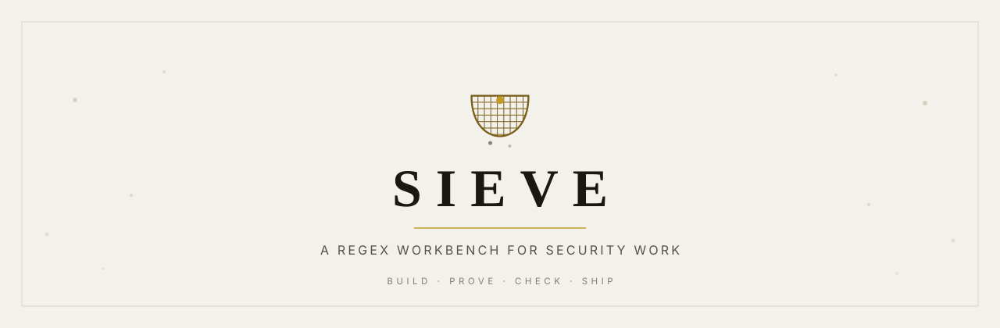
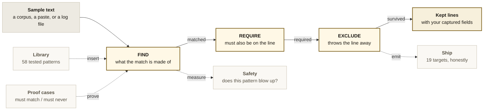
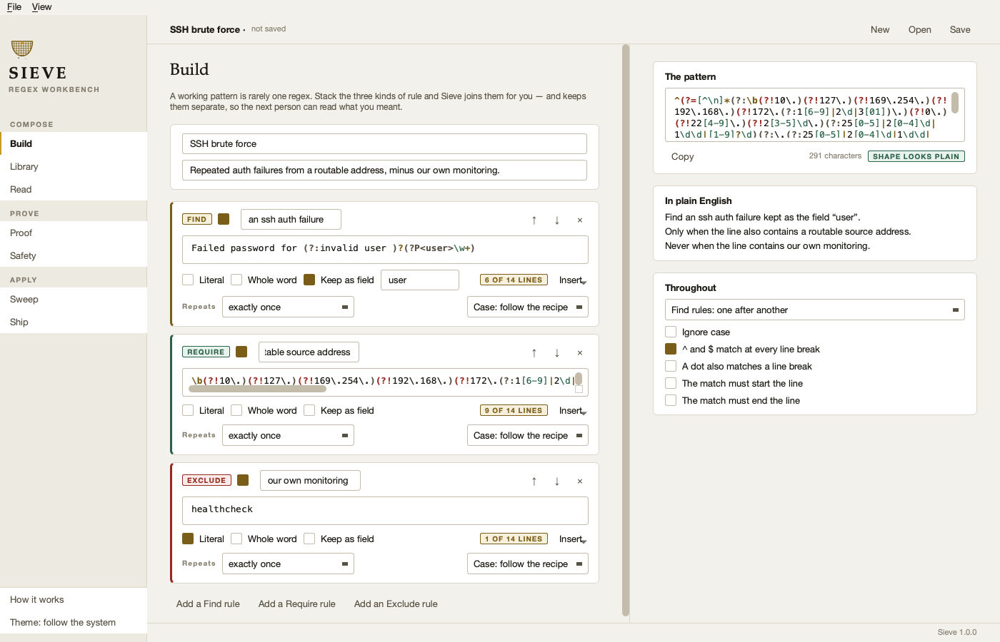
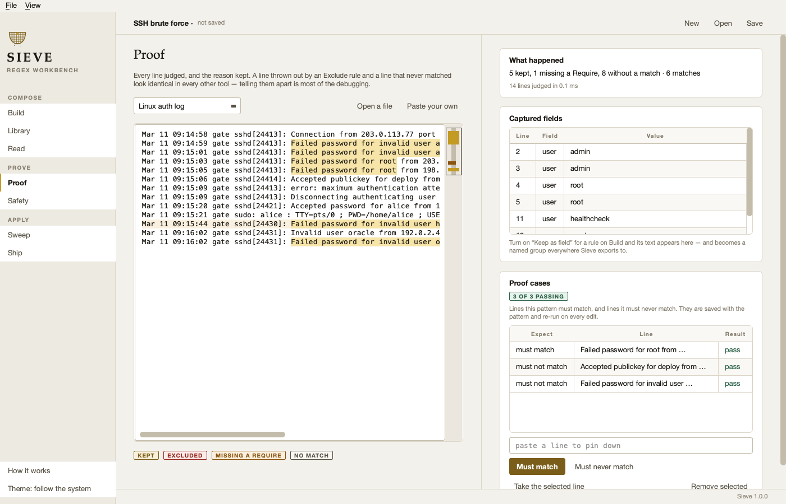
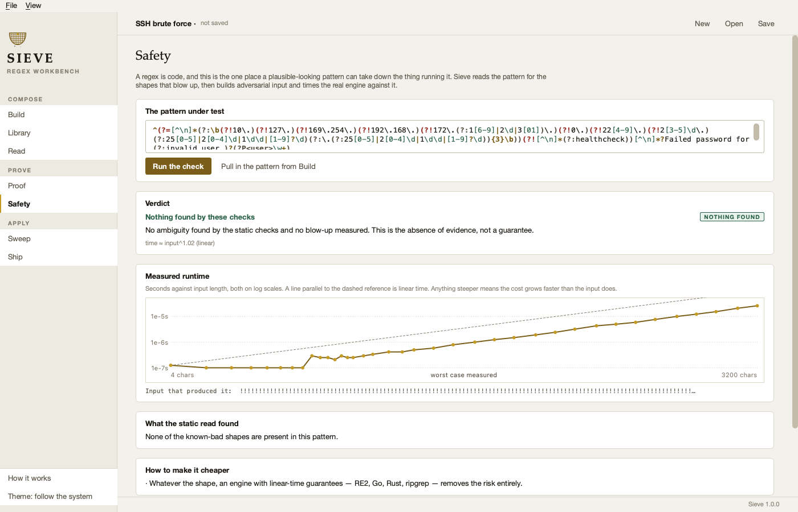
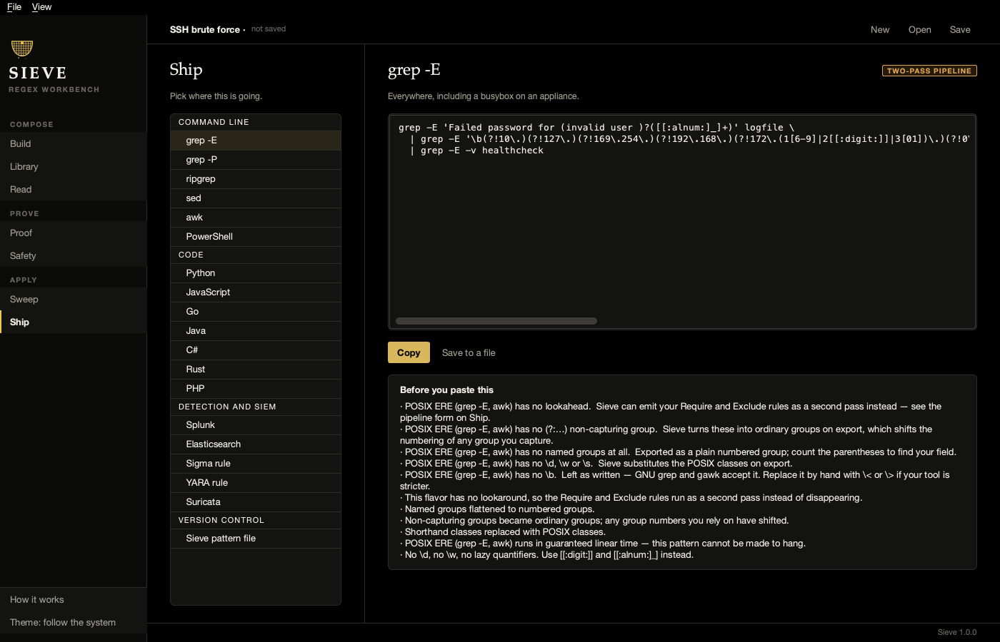

<div align="center">

<picture>
  <source media="(prefers-color-scheme: dark)" srcset="docs/banner-dark.svg">
  <source media="(prefers-color-scheme: light)" srcset="docs/banner-light.svg">
  
</picture>

<br>

[](https://github.com/at0m-b0mb/Sieve-Regex-Workbench/actions/workflows/tests.yml)
[](https://www.python.org/)
[](#install)
[](LICENSE)
[](#the-library)
[](#tests)

**Build a pattern from _find_, _require_ and _exclude_ rules.
Prove it against cases that must match and cases that must never.
Check it for catastrophic backtracking.
Then ship it to whichever of 19 tools will actually run it.**

</div>

---

## Why this exists

A regex that works in a tester is not a regex that works in production.

|  | What goes wrong |
|---|---|
| **The engine changes** | You validate in Python, deploy to **Go**. RE2 has no lookaround at all, and your `Exclude` rules silently vanish. |
| **The dialect changes** | You write `\d`, deploy to **POSIX grep**, which has never heard of it. The rule matches nothing for six months and nobody notices. |
| **The input is hostile** | That email validator from a blog post backtracks **exponentially**. A forty-character request takes the service down. |
| **Time passes** | Six months on, nobody can tell whether the pattern still does what its name claims, because it is one unbroken line of punctuation. |

Sieve is built around those four failures.

---

## How it works

Text goes in on the left and passes three named gates. Everything else in the
application hangs off that spine.



| Gate | What it is |
|:--|:--|
| **Find** | What the match itself is made of. Several Find rules join one after another, as alternatives, or as an unordered set — your choice, stated once rather than encoded in punctuation. |
| **Require** | A condition on the *line*, not on the match. "Only when the word failure is also present." Becomes a lookahead — or a second pass, where the target engine has none. |
| **Exclude** | The noise you already know about: your own scanner, your health checks, the service that logs an error every minute and always has. This is the rule kind that turns a demo into a detection. |

The three stay **separate** in the saved file and are joined only when the
pattern is emitted — so the next person can switch one off and see what changes.

---

## The screens

### Build — compose the rules, watch the regex and the English assemble together



Never written a regex before? Every construct is in the **Insert** menu by its
English name — *any digit*, *one or more*, *either this or that*, *only if not
followed by* — dropped in at the cursor with the part you need to replace
already selected. You are still editing the real pattern, which is the only way
anyone ever learns the syntax.

### Proof — every line judged, and the reason kept



A line thrown out by an `Exclude` rule and a line that simply never matched look
identical in every other tool. Telling them apart is most of the debugging, so
Sieve tints them differently and names the rule responsible.

The ribbon beside the corpus is the **match map**: one hairline per line,
coloured by verdict. At a glance you see whether hits cluster or spread, whether
an Exclude rule ate a whole region, and whether the pattern fires on *every*
line — which almost always means it is looser than you intended.

### Safety — does this pattern blow up?



A static read finds the shapes known to backtrack — nested quantifiers,
overlapping alternation, adjacent unbounded repeats. Then a probe builds
adversarial input, **times the real engine** against growing lengths, and plots
the curve against a linear-time reference.

It never says a pattern is safe. It says what it checked and what it measured.

### Ship — 19 targets, and the truth about each one



Picked `grep -E` for a recipe with `Exclude` rules? POSIX has no lookaround, so
Sieve emits a **two-pass pipeline** rather than dropping your exclusions and
handing you something that over-matches:

```bash
grep -E 'Failed password for (invalid user )?([[:alnum:]_]+)' logfile \
  | grep -E -v healthcheck
```

Note the `(?:` that became `(`, and the `\w` that became `[[:alnum:]_]` —
because POSIX has neither, and a pattern that compiles but means something
different is the worst outcome available.

---

## The library

**58 patterns across 10 families**, and every one carries the examples it must
match and the examples it must not. The suite runs all of them, so a broken
pattern fails CI instead of failing a detection.

`Network` · `Credentials and secrets` · `Hashes and crypto` · `Threat intelligence` · `Web and injection` · `Files and paths` · `Windows` · `Log formats and time` · `Personal data` · `Cloud`

Every card also states what the pattern **cannot** do:

> **AWS access key ID** — `\b(?:A3T[A-Z0-9]|AKIA|ABIA|ACCA|ASIA)[A-Z0-9]{16}\b`
> *Finds the ID, never the secret, and cannot tell you whether the key is live.
> Treat every hit as live until proven dead.*

> **Payment card number** — *Does not run the Luhn check, so a fraction of hits
> are not valid card numbers.*

That is not a disclaimer. It is the part an analyst needs before pasting a
pattern into a SIEM.

---

## Install

```bash
git clone https://github.com/at0m-b0mb/Sieve-Regex-Workbench.git
cd Sieve-Regex-Workbench
pip install -r requirements.txt
python3 run.py
```

Or install it properly and get both entry points:

```bash
pip install .
sieve            # the window
sieve --help     # the command line
```

Python 3.10+, PyQt6, nothing else. macOS, Windows and Linux.

---

## The command line

`sieve/core/` imports no GUI toolkit, so the same engine runs in CI. A saved
pattern is a plain JSON file, and `sieve test` exits non-zero when a proof case
fails — which is what makes a detection something you can put in a pipeline
rather than something you remember to check.

```bash
sieve test detections/ssh-brute-force.sieve       # re-run its proof cases
sieve lint --strict 'my (pattern|here)+'          # ReDoS + portability, exit 1 if risky
sieve explain '^(?!.*healthcheck).*error'         # read a regex back in English
sieve scan patterns/aws-keys.sieve ~/src --redact # sweep a tree, redact the hits
sieve emit detections/x.sieve sigma               # write it out as a Sigma rule
sieve library rfc1918 --quiet                     # browse the library
```

A pre-commit hook that refuses a detection whose own proof cases fail:

```bash
#!/bin/sh
for f in detections/*.sieve; do sieve test "$f" || exit 1; done
```

---

## Engines it knows about

| Engine | What it cannot do |
|:--|:--|
| **Python `re`** | — |
| **PCRE2** (`grep -P`, PHP, nginx) | — the most featureful, and the easiest to write a catastrophic pattern in |
| **RE2** (Go, ripgrep, CloudFlare) | no lookaround, no backreferences — and in exchange, guaranteed linear time |
| **JavaScript** (ES2018+) | no inline flags; lookbehind only from ES2018 (Safari 16.4) |
| **Java** | bounded-width lookbehind only |
| **.NET** | — the only common engine with true variable-length lookbehind |
| **Rust `regex`** | RE2's design and RE2's omissions |
| **POSIX ERE** (`grep -E`, awk) | no `\d`, no `\w`, no lazy quantifiers, no `(?:…)` |
| **POSIX BRE** (`grep`, sed) | all of the above, and `(` `)` `+` `?` need escaping |

Each is checked against what it *really* supports: lookaround, lookbehind width,
named-group spelling, atomic groups, possessive quantifiers, backreferences,
shorthand classes, word boundaries, unicode properties, inline and scoped flags,
lazy quantifiers, conditionals and recursion.

---

## Design notes

**Warm paper, not white.** A screen full of monospaced log text on pure white
glares. The ground is `#F3F1EC` with white cards and hairline rules.

**Two golds, not one.** A deep brass for anything carrying words, a brighter
gold reserved for marks that carry none. One gold cannot be a fill behind white
text *and* a bright accent *and* small text on paper.

**Dark mode is true black.** `#000000` with neutral greys above it. A test
asserts that no colour in the dark ramp reads as blue.

**Contrast is measured, not eyeballed.** `tests/test_theme.py` checks every
text-on-ground pairing against WCAG AA in both themes. It caught two failures
the eye had passed.

**The mark** is a sieve seen from the side: two grains through the mesh, one held
back. Find, and exclude.

---

## Tests

```bash
pip install -r requirements-dev.txt
python3 -m pytest
```

Over 600 tests, on three operating systems and three Python versions. The ones
that matter most:

- **Proof and Ship can never disagree** — a fuzzer runs thousands of generated
  recipes through both the live matcher and the compiled pattern and asserts
  they reach the same verdict. This is the bug class that would make the whole
  tool a liar, so it is tested by search rather than by example.
- Every library pattern against its own positive and negative examples.
- Every library pattern proved **not** to backtrack catastrophically.
- The explainer reconstructing every pattern byte for byte.
- **No export target silently dropping a rule** — checked by parsing the emitted
  YAML and JSON, not by looking for substrings in the text.
- The ReDoS probe staying bounded on a pathological pattern.
- Every colour pairing meeting WCAG AA in both themes.
- The window itself, driven headlessly: every page built, both themes applied,
  every target emitted, a real sweep run, a document round-tripped.

---

## Scope

Sieve is for authorised work on systems and data you are responsible for. The
patterns here find things; what you do about them is the job.

The `Personal data` family exists so you can **find personal data in order to
redact it** — which is why the scanner and every report format take `--redact`,
replacing each match with blocks while keeping its length. A report can prove
the data is present without carrying it.

---

<div align="center">

**MIT** · [LICENSE](LICENSE) · [CHANGELOG](CHANGELOG.md)

</div>
